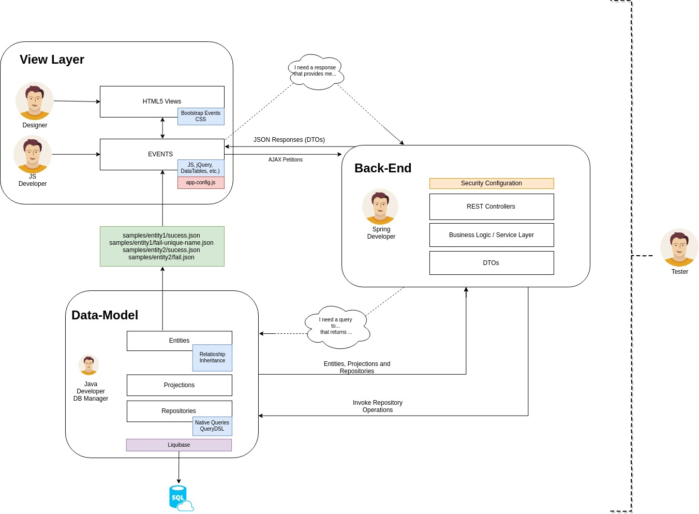

= Roles division

This proof of concepts tries to demostrate that divide developers in specific roles (Front-end, back-end, database, etc.) could be better than to have a full-stack developers. The main reason is that we will be able to create web applications with more quality because each developer has big knoweldges about his own area.

A quick schema about the roles division and how all the developers interact between them:

== View Layer

TODO

== Data-Model 

TODO

== Back-end

TODO
 
