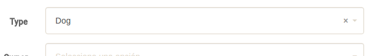

= Spring Security and Formatters

This proof of concept tries to demostratse that exists an error during formatters registration in a Spring 4.3.3 application using Spring Boot.

The desired steps to a valid `Formatters` registration are:

. First of all, the method https://github.com/spring-projects/spring-framework/blob/master/spring-webmvc/src/main/java/org/springframework/web/servlet/config/annotation/WebMvcConfigurerComposite.java#L42[addWebMvcConfigurers] located in https://github.com/spring-projects/spring-framework/blob/master/spring-webmvc/src/main/java/org/springframework/web/servlet/config/annotation/WebMvcConfigurerComposite.java[WebMvcConfigurationComposite] should registrate all the web configurers. That includes the `formatters`.
. After that, when some component needs to `@Autowired` a `ConversionService` instance, the method https://github.com/spring-projects/spring-framework/blob/master/spring-webmvc/src/main/java/org/springframework/web/servlet/config/annotation/WebMvcConfigurationSupport.java#L602[mvcConversionService] located in https://github.com/spring-projects/spring-framework/blob/master/spring-webmvc/src/main/java/org/springframework/web/servlet/config/annotation/WebMvcConfigurationSupport.java[WebMvcConfigurationSupport] obtains a `ConversionService` instance and register all the existing `formatters` on it before return the instance.

However, if a `@Configuration` class extends the `WebSecurityConfigurerAdapter` abstract class, some component is trying to `@Autowired` a `ConversionService` instance before the `formatters` have been registered in the Spring context, so the `addFormatters` method doesn't include any `formatters` on it.

If you execute this proof of concept using the `mvn compile spring-boot:run` command, you could check that the `Create Pets` view shows an enum value without apply the conversion to String.

== Work-around

Seems like the component that requires the `ConversionService` instance is the `ContentNegotiation` that is beeing `@Autowired` in the https://github.com/spring-projects/spring-security/blob/master/config/src/main/java/org/springframework/security/config/annotation/web/configuration/WebSecurityConfigurerAdapter.java#L376[WebSecurityConfigurerAdapter]. 

A simple work-around is to `@Override` the https://github.com/jcagarcia/proofs/blob/master/spring-security-and-formatters/src/main/java/org/springframework/roo/petclinic/config/security/SecurityConfiguration.java#L54[setContentNegotiationStrategy] method in our https://github.com/jcagarcia/proofs/blob/master/spring-security-and-formatters/src/main/java/org/springframework/roo/petclinic/config/security/SecurityConfiguration.java[SecurityConfiguration] class without include the `@Autowired` annotation. _(This proof of concept includes this work-around commented)_

After that, execute this proof of concept again using the `mvn compile spring-boot:run` command and you could check that the `Create Pets` view shows an enum value with a valid format applied.

